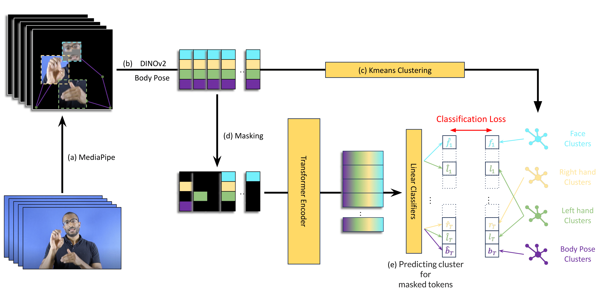

## SHuBERT: Self-Supervised Sign Language Representation Learning via Multi-Stream Cluster Prediction

This repository contains research code for the paper [*SHuBERT: Self-Supervised Sign Language Representation Learning via Multi-Stream Cluster Prediction*](https://arxiv.org/abs/2411.16765).

<p align="middle">
  
</p>


We introduce SHuBERT (Sign Hidden-Unit BERT), a self-supervised contextual representation model learned from approximately 1,000 hours of  American Sign Language video. SHuBERT adapts masked token prediction objectives to multi-stream visual sign language input, learning to predict multiple targets corresponding to clustered hand, face, and body pose streams. SHuBERT achieves state-of-the-art performance across multiple tasks including sign language translation, isolated sign language recognition, and fingerspelling detection.  

----

### Installation

We provide installation and inference instructions in [QUICKSTART.md](QUICKSTART.md).

### Usage
#### 1. Preparing the data

We describe how to prepare the datasets in [DATASETS.md](DATASETS.md).


#### 2. Model Weights

Please download the weight of SHuBERT(Base) [link](https://drive.google.com/drive/folders/1aOZEkENp2B-5sRq5F67dYsirnHwsFjKV?usp=sharing).

#### 3. Feature Extraction

We describe how to extract features from the pretrained model in [FEATURES.md](FEATURES.md).


#### 4. Pretraining

- sbatch train_shubert.sh


#### 5. Fine-tuning on Downstream Tasks

TODO

---- 
### Citing our work
If you find our work useful in your research, please consider citing:

```bibtex
@inproceedings{gueuwou-etal-2025-shubert,
    title = "SHuBERT: Self-Supervised Sign Language Representation Learning via Multi-Stream Cluster Prediction",
    author = "Gueuwou, Shester and Du, Xiaodan and Shakhnarovich, Greg and Livescu, Karen and Liu, Alexander H.",
    booktitle = "Proceedings of the 63rd Annual Meeting of the Association for Computational Linguistics (Volume 1: Long Papers)",
    year = "2025",
    address = "Vienna, Austria",
    publisher = "Association for Computational Linguistics",
}
```


### References
This codebase is heavily influenced by the [Fairseq](https://github.com/facebookresearch/fairseq) and [DinoSR](https://github.com/Alexander-H-Liu/dinosr) repositories.

### License
This project is primarily under the MIT license.